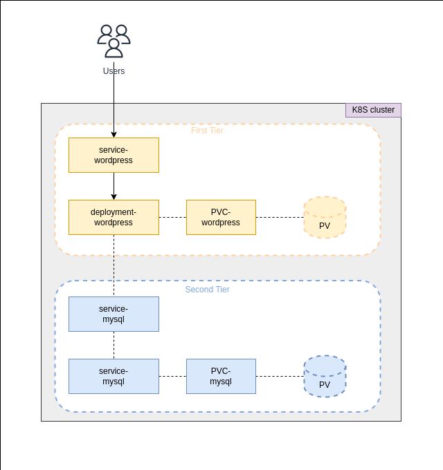

# Dyploma
**Goal:** *Learn how to deploy Multi-Tier application with persistance storage to Kubernetes cluster*

# Prerequirements
- [Install docker](https://docs.docker.com/engine/install/ubuntu/)
- [Install kubectl](https://kubernetes.io/ru/docs/tasks/tools/install-kubectl/)
- [Install kind](https://kind.sigs.k8s.io/docs/user/quick-start/#installation)
- [Install kustomize](https://kubectl.docs.kubernetes.io/installation/kustomize/binaries/)

# TODO 
- [x] Install required tools
- [x] Create k8s cluster
- [x] Deploy wordpress instance
- [x] Deploy MySQL database
- [x] Configure PVC volumes
- [x] Test the application
- [ ] Add network policies 
- [x] Add `Makefile` for the project
- [x] Add Kustomize files
- [ ] Add `Getting Started` section
